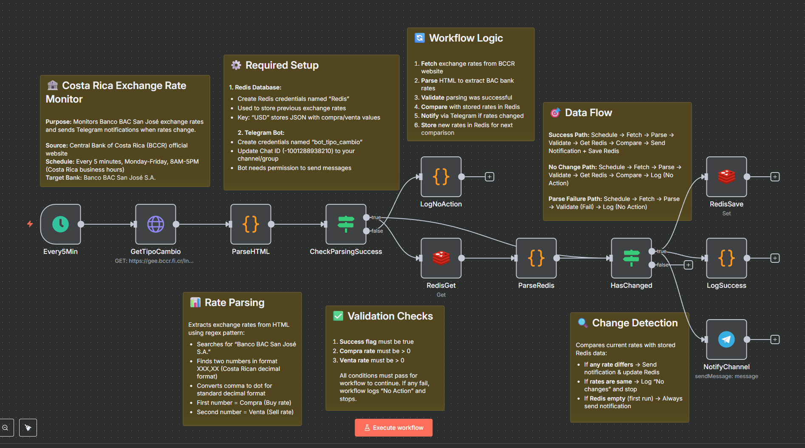

# N8N Exchange Rate Monitor Workflow Documentation

## Overview

This n8n workflow monitors Costa Rican exchange rates from the Central Bank (BCCR) website and automatically sends notifications to a Telegram channel when rates change. It specifically tracks the USD exchange rates from "Banco BAC San José S.A." and runs during business hours to provide timely updates.



## Workflow Summary

- **Purpose**: Monitor and notify about USD exchange rate changes
- **Source**: BCCR (Banco Central de Costa Rica) official website
- **Target Bank**: Banco BAC San José S.A.
- **Notification**: Telegram channel
- **Storage**: Redis for rate comparison
- **Schedule**: Every 5 minutes, Monday-Friday, 8 AM - 5 PM

## Architecture Flow

```
Schedule Trigger → Fetch Data → Parse HTML → Validate → Check Redis → Compare → Notify & Save
```

## Node Configuration Guide

### 1. Every5Min (Schedule Trigger)
**Type**: `n8n-nodes-base.scheduleTrigger`
**Purpose**: Triggers the workflow execution

**Configuration**:
- **Cron Expression**: `*/5 8-17 * * 1-5`
- **Schedule**: Every 5 minutes, Monday-Friday, 8 AM-5 PM
- **Timezone**: Server timezone (adjust as needed)

**Maintenance Notes**:
- Modify cron expression to change frequency or hours
- Consider Costa Rica business hours when adjusting schedule

### 2. GetTipoCambio (HTTP Request)
**Type**: `n8n-nodes-base.httpRequest`
**Purpose**: Fetches exchange rate data from BCCR website

**Configuration**:
- **URL**: `https://gee.bccr.fi.cr/IndicadoresEconomicos/Cuadros/frmConsultaTCVentanilla.aspx`
- **Method**: GET
- **Options**: Default

**Troubleshooting**:
- If this fails, check if BCCR website structure changed
- Verify URL is still accessible
- Monitor for HTTP errors or timeouts

### 3. ParseHTML (Code Node)
**Type**: `n8n-nodes-base.code`
**Purpose**: Extracts BAC San José exchange rates from HTML response

**Key Variables**:
- `BANCO`: "Banco BAC San José S.A." (target bank identifier)
- `compra`: Buy rate
- `venta`: Sell rate

**Regex Pattern**:
```javascript
/Banco BAC San José S\.A\.[\\s\\S]*?(\\d{3},\\d{2})[\\s\\S]*?(\\d{3},\\d{2})/
```

**Output Format**:
```json
{
  "compra": 520.50,
  "venta": 530.75,
  "timestamp": "2025-08-02T14:30:00.000Z",
  "success": true,
  "bank": "Banco BAC San José S.A."
}
```

**Maintenance**:
- If parsing fails, check if bank name changed on website
- Verify regex pattern matches current HTML structure
- Monitor `success` field in output

### 4. CheckParsingSuccess (IF Node)
**Type**: `n8n-nodes-base.if`
**Purpose**: Validates successful rate extraction

**Conditions** (ALL must be true):
- `success` = true
- `compra` > 0
- `venta` > 0

**Flow**:
- **TRUE**: Continue to Redis check
- **FALSE**: Log no action and stop

### 5. RedisGet (Redis Node)
**Type**: `n8n-nodes-base.redis`
**Purpose**: Retrieves previously stored exchange rates

**Configuration**:
- **Operation**: GET
- **Key**: "USD"
- **Credentials**: Redis connection (ID: 1APHQ9C3yyTSy11N)

**Data Format in Redis**:
```json
{
  "compra": 520.50,
  "venta": 530.75,
  "timestamp": "2025-08-02T14:25:00.000Z"
}
```

### 6. ParseRedis (Code Node)
**Type**: `n8n-nodes-base.code`
**Purpose**: Processes Redis response and handles missing data

**Functionality**:
- Handles first-run scenario (no existing data)
- Parses JSON string from Redis
- Converts rates to integers for comparison
- Returns default values (0,0) if parsing fails

### 7. HasChanged (IF Node)
**Type**: `n8n-nodes-base.if`
**Purpose**: Compares current rates with stored rates

**Condition**:
```javascript
$('CheckParsingSuccess').item.json.compra !== $('ParseRedis').item.json.compra || 
$('CheckParsingSuccess').item.json.venta !== $('ParseRedis').item.json.venta
```

**Flow**:
- **TRUE**: Rates changed → Notify and save
- **FALSE**: No changes → End workflow

### 8. NotifyChannel (Telegram Node)
**Type**: `n8n-nodes-base.telegram`
**Purpose**: Sends rate update to Telegram channel

**Configuration**:
- **Chat ID**: `-1001288938210` (Telegram channel ID)
- **Message Format**: `Compra: ₡{compra} | Venta: ₡{venta}`
- **Credentials**: bot_tipo_cambio (ID: UbxyNb41KpyNaX6Z)

**Message Example**:
```
Compra: ₡520.50 | Venta: ₡530.75
```

### 9. RedisSave (Redis Node)
**Type**: `n8n-nodes-base.redis`
**Purpose**: Stores new exchange rates for future comparison

**Configuration**:
- **Operation**: SET
- **Key**: "USD"
- **Value**: JSON string with compra, venta, and timestamp

### 10. LogSuccess (Code Node)
**Type**: `n8n-nodes-base.code`
**Purpose**: Logs successful execution details

**Console Output**:
```
📊 EXCHANGE RATES UPDATED:
   Compra: ₡520.50
   Venta: ₡530.75
   Timestamp: 2025-08-02T14:30:00.000Z
   📢 Notification sent
   💾 Data saved to Redis
──────────────────────────────────────────────────
```

### 11. LogNoAction (Code Node)
**Type**: `n8n-nodes-base.code`
**Purpose**: Logs when no action is taken

**Console Output**:
```
ℹ️  WORKFLOW COMPLETED - NO ACTION TAKEN
   Reason: No changes detected in exchange rates
   Timestamp: 2025-08-02T14:30:00.000Z
──────────────────────────────────────────────────
```

## Credentials Setup

### Required Credentials

1. **Redis Connection** (ID: 1APHQ9C3yyTSy11N)
   - Host: Redis server address
   - Port: Redis port (usually 6379)
   - Password: Redis authentication
   - Database: Redis database number

2. **Telegram Bot** (ID: UbxyNb41KpyNaX6Z)
   - Bot Token: Telegram bot API token
   - Chat ID: Target channel/group ID

### Setting Up Telegram Bot

1. Create bot via @BotFather on Telegram
2. Get bot token
3. Add bot to target channel
4. Get channel ID using bot API or tools
5. Configure credentials in n8n

## Monitoring & Troubleshooting

### Common Issues

1. **Parsing Failures**
   - Check if BCCR website HTML structure changed
   - Verify bank name spelling in regex
   - Monitor `success` field in ParseHTML output

2. **Redis Connection Issues**
   - Verify Redis server is running
   - Check credentials and network connectivity
   - Monitor Redis logs for errors

3. **Telegram Notifications Not Sent**
   - Verify bot token is valid
   - Check if bot is added to target channel
   - Confirm channel ID is correct

4. **Schedule Not Running**
   - Check if workflow is active
   - Verify cron expression syntax
   - Consider timezone differences

### Monitoring Tips

1. **Check Execution Logs**
   - Monitor workflow executions in n8n
   - Look for error patterns
   - Check node-specific logs

2. **Redis Data Verification**
   - Manually check Redis key "USD"
   - Verify data format matches expected structure
   - Monitor for stale data

3. **Rate Change Verification**
   - Compare notifications with official BCCR rates
   - Verify timing aligns with business hours
   - Check for false positives

## Maintenance Schedule

### Daily
- Monitor execution logs for errors
- Verify notifications are being sent

### Weekly
- Check Redis data consistency
- Verify BCCR website accessibility
- Review Telegram bot status

### Monthly
- Update credentials if needed
- Review and optimize cron schedule
- Test failure scenarios

## Configuration Variables

### Easily Modifiable Settings

```javascript
// In ParseHTML node
const BANCO = "Banco BAC San José S.A."; // Target bank name

// In NotifyChannel node
chatId: "-1001288938210" // Telegram channel ID

// In Redis nodes
key: "USD" // Redis storage key

// In Every5Min node
cronExpression: "*/5 8-17 * * 1-5" // Schedule pattern
```

## Error Handling

The workflow includes robust error handling:

1. **Silent Failures**: Parsing errors don't break workflow
2. **Default Values**: Missing Redis data defaults to 0,0
3. **Validation**: Multiple checks prevent invalid data processing
4. **Logging**: Comprehensive logs for debugging

## Security Considerations

1. **Credentials**: Store securely in n8n credential manager
2. **API Keys**: Regularly rotate Telegram bot tokens
3. **Network**: Ensure secure Redis connections
4. **Access**: Limit workflow edit permissions

## Backup & Recovery

1. **Workflow Export**: Regular JSON backups
2. **Redis Backup**: Schedule Redis data dumps
3. **Credentials Backup**: Secure credential documentation
4. **Testing**: Regular recovery procedure testing

---

**Last Updated**: August 2025  
**Version**: 1.0  
**Maintainer**: [Your Name/Team]